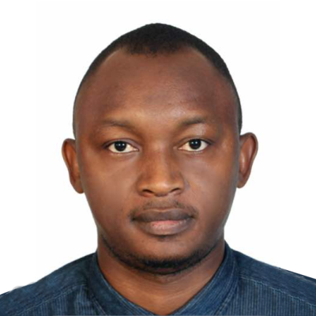

# About Me - Dr. Umar Ahmad, Scientist

Hello, I'm Dr. Umar Ahmad, a passionate scientist dedicated to exploring the mysteries of the universe through research and experimentation. With a background in astrophysics and a heart full of curiosity, I have spent years unraveling the secrets of the cosmos.

## Background

I earned my Ph.D. in Astrophysics from the esteemed Galileo University, where I delved into the complexities of black holes and the behavior of dark matter. My research took me to remote observatories, where I marveled at the dance of celestial bodies and questioned the nature of space and time.

## Research Interests

My primary focus lies in the realm of theoretical physics. I'm fascinated by the enigmatic properties of quantum mechanics and the potential implications of string theory. Exploring the fabric of reality at its most fundamental level fuels my desire to push the boundaries of our understanding.

## Contributions to Science

My work has led to several breakthroughs in the field of astrophysics. One of my notable contributions was the development of a novel method to study gravitational waves emitted by merging neutron stars. This discovery shed light on the origins of heavy elements and their role in shaping the cosmos.

## Passion for Education

Alongside my research endeavors, I am passionate about educating the next generation of scientists. I've had the privilege of mentoring young minds, fostering their curiosity, and guiding them on their scientific journeys. Through public lectures and outreach programs, I strive to make the wonders of the universe accessible to all.

## Personal Philosophy

As a scientist, I believe in the power of imagination and the importance of asking questions that challenge conventional wisdom. The pursuit of knowledge is a journey with no final destination; it's about embracing the unknown and daring to explore uncharted territories.

Whether peering through a telescope or scribbling equations on a whiteboard, I am driven by a desire to uncover the secrets of the cosmos and contribute to the collective human understanding of our place in the universe.

Feel free to reach out if you're as passionate about the mysteries of science as I am. Let's embark on this cosmic journey together!

Connect with me on [LinkedIn](https://www.linkedin.com/in/) | Follow me on [Twitter](https://twitter.com/) | Email: example@mail.com
